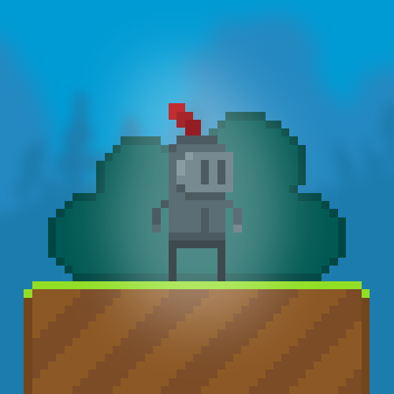
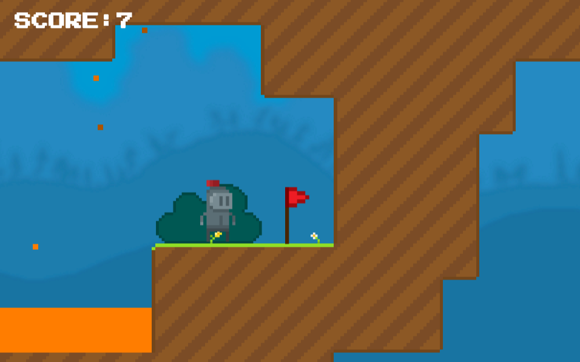

<h1>KNIGHT</h1>

<h3>-- PLAY A GAME --</h3>

➤ DOWNLOAD GAME FOR <b>WINDOWS</b> - https://devlever.itch.io/knight

➤ DOWNLOAD GAME FOR <b>MAC</b> - https://devlever.itch.io/knight

➤ DOWNLOAD GAME FOR <b>LINUX</b> - https://devlever.itch.io/knight

➤ PLAY IN BROWSER - https://danielpetelin.github.io/KNIGHT/

<h3>-- ABOUT THE GAME --</h3>

<b>Indie platformer</b> game consisting of one level.

"Initially, I did not expect this project to be public" - <b>the creator</b>.

The essence of the game is to get to the red flag.

<h3>-- CHARACTERISTICS --</h3>

Title: <b>KNIGHT</b>

Genre: <b>Platformer</b>, <b>Indie</b>

Developer: <b>DevLever</b>

Status: <b>Release</b>

Age restriction: <b>3+</b>

Price: <b>Free to play</b>

Estimated gameplay time: <b>8 minutes</b>

<h3>-- CREDITS --</h3>

Artist - <a href="https://connect.unity.com/u/devlever"><b>DevLever</b></a>

Programmer - <a href="https://connect.unity.com/u/devlever"><b>DevLever</b></a>

Music by <a href="https://www.youtube.com/channel/UCGJCgCbdJk_7NBJYED3idwg/videos"><b>Egor Petelin</b></a>

